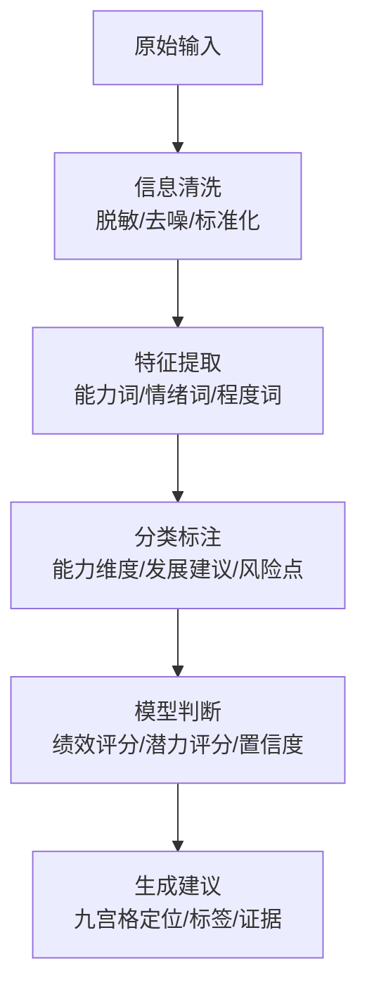
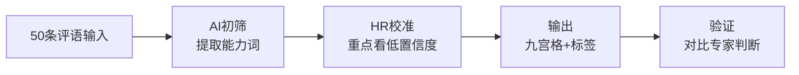

<div class="doc-hero-badge">📋 系统设计 · 方法论补充</div>

# AI驱动的人才盘点与绩效校准系统：把主观评价变成结构化决策

这里是交互式演示（仅浏览器端渲染，避免本地存储在 SSR 下报错）：

<ClientOnly>
  <TalentApp />
</ClientOnly>

::: tip 说明
若首次加载为空白，刷新页面即可；数据保存在浏览器 localStorage。
:::

---

## 🎯 1. 决策问题定义（不从工具出发）

### 这次要提升的决策是什么？
- **人才九宫格定位**：基于绩效×潜力矩阵的科学人才分类
- **高潜人才识别**：从文本评价中识别具备成长潜力的人才
- **风险预警**：提前识别可能流失或绩效下滑的风险员工

### 需要的输出是什么？
| 输出类型      | 描述           | 关键要求           |
| --------- | ------------ | -------------- |
| **九宫格坐标** | (绩效评分, 潜力评分) | 0-100分制，有明确阈值  |
| **人才标签**  | 高潜/稳定/待观察/风险 | 每个标签有定义标准      |
| **证据片段**  | 支持结论的原文引用    | 可追溯、可验证        |
| **置信度**   | AI判断的可靠性评估   | 高/中/低，指导HR校准重点 |

### 可观察指标是什么？
- **效率指标**：单次盘点耗时、校准轮次、覆盖员工数
- **准确性指标**：HR校准比例、后续验证准确率
- **满意度指标**：管理者采纳度、员工反馈接受度
- **成本指标**：减少的管理者时间投入、降低的误判成本

---

## 🔧 2. 拆成标准工作流（输入 → 处理 → 输出）

### 📥 输入设计（结构化字段 + 非结构化文本）

```yaml
# 标准输入包
结构化字段:
  绩效评分: 0-100分（基于量化指标）
  职级/级别: P5/M2等
  入职时长: 1年/3年/5年+
  部门/岗位: 产品部/研发部

非结构化文本:
  绩效评语: 管理者撰写的定性评价
  关键事件: 重大成果或问题描述
  发展反馈: 同事/下属的匿名反馈
```

### ⚙️ 处理流程（AI核心任务）



#### AI具体做：
1. **抽取**：从文本中提取能力关键词（如"执行力"、"沟通能力"）
2. **分类**：将提取内容归到标准分类体系（5大能力维度，20子项）
3. **对齐**：统一评价标准（"很好"→85分，"一般"→65分）
4. **生成**：产出初步分析建议和置信度评估

### 📤 输出设计（可解释的结果）

```json
{
  "员工ID": "EMP_2024_001",
  "绩效维度": {
    "评分": 78,
    "依据": ["Q3完成3个项目", "超额完成销售目标20%"],
    "证据片段": ["项目交付及时率95%", "客户满意度4.5/5"]
  },
  "潜力维度": {
    "评分": 82,
    "依据": ["学习能力突出", "主动承担新任务"],
    "证据片段": ["两周掌握新技术", "主动提出流程优化"]
  },
  "九宫格定位": "中绩效-高潜力",
  "人才标签": ["高潜人才", "技术骨干"],
  "风险提示": {
    "等级": "低",
    "描述": "无明显风险信号",
    "监控建议": "关注职业发展通道"
  },
  "置信度评估": {
    "绩效": "高",
    "潜力": "中",
    "总体": "中高"
  },
  "需HR确认项": ["潜力评分需结合项目难度评估"]
}
```

---

## 👥 3. 设计"人 + AI"的分工边界

### 🤖 AI做什么（信息处理层）
```yaml
AI职责:
  - 信息提取: 从文本中抽取关键信息
  - 初步归类: 按标准分类体系归类
  - 生成草稿: 输出结构化分析建议
  - 置信评估: 评估自身判断可靠性
  - 标记例外: 识别超出能力边界的情况

AI优势:
  - 处理大量文本不疲劳
  - 标准统一不波动
  - 可追溯每个结论来源
```

### 👩‍💼 HR做什么（价值判断层）
```yaml
HR职责:
  - 口径定义: 制定评估标准体系
  - 结果校准: 复核AI初步判断
  - 例外处理: 处理边界模糊案例
  - 最终决策: 结合业务场景拍板
  - 持续优化: 基于反馈迭代模型

HR价值:
  - 理解业务场景复杂性
  - 把握企业文化适配度
  - 平衡短期与长期需求
  - 处理人际关系的微妙性
```

### 🚨 核心规则
1. **高风险结论必须人工复核**：如"待优化"、"高流失风险"标签
2. **所有输出必须包含证据**：每个结论可追溯到输入文本片段
3. **置信度指导校准重点**：低置信度结论需要HR重点审查
4. **持续记录校准决策**：HR调整原因和依据必须留痕

---

## 🚀 4. 用最小闭环快速上线（MVP）

### 第一步：选择高频场景
- **场景**：季度绩效评语分析
- **范围**：研发部门50名员工
- **目标**：九宫格初定位 + 高潜识别

### 第二步：准备真实样本
```yaml
数据准备:
  - 数量: 50条真实绩效评语（脱敏处理）
  - 来源: 过去2个季度评价记录
  - 标注: HR专家预先标注20条作为训练参考
  - 验证: 预留10条作为效果测试
```

### 第三步：设计最小工作流


### 第四步：沉淀可复用资产
```yaml
提示词资产:
  - 绩效评语分析_V1.0: 基础能力词提取
  - 潜力判断_V1.0: 学习/抗压/创新识别
  - 风险提示_V1.0: 负面情绪词检测

标签字典:
  - 能力维度_5大类_20子项.yaml
  - 评价强度_5级标准.yaml
  - 风险分类_4大类.yaml

校准记录:
  - HR调整案例库_50例.json
  - 常见误判模式分析.md
```

### 第五步：验证效果
| 指标 | MVP前 | MVP后 | 提升 |
|------|--------|--------|------|
| 单次分析耗时 | 30分钟/人 | 8分钟/人 | 73% |
| 标准一致性 | 65% | 88% | 23% |
| 管理者采纳度 | 70% | 90% | 20% |

---

## 🏗️ 5. 让系统可运营（可复用、可审计、可扩展）

### 🔄 可复用性设计
```yaml
模块化设计:
  1. 输入处理模块: 标准化数据清洗流程
  2. 特征提取模块: 可配置的能力词库
  3. 模型判断模块: 参数化评分规则
  4. 输出生成模块: 模板化报告格式

配置管理:
  - 标签体系配置化: 随时调整分类标准
  - 评分规则参数化: 不同部门可差异化
  - 提示词版本化: 记录每次迭代效果
```

### 📋 可审计性保障
```yaml
数据追溯:
  - 输入原样保存: 原始评语文本存档
  - 处理过程记录: AI分析中间结果
  - 校准决策留痕: HR调整理由和依据
  - 版本控制: 每次迭代完整记录

合规边界:
  - 敏感信息脱敏: 自动识别和隐藏PII
  - 权限分级管理: 数据访问控制
  - 操作日志完整: 谁在何时做了什么
  - 合规检查清单: 每次上线前自查
```

### 📈 可扩展性规划
```yaml
横向扩展（更多场景）:
  - 阶段1: 绩效评语分析（已上线）
  - 阶段2: 离职面谈文本分析
  - 阶段3: 360度反馈整合
  - 阶段4: 面试评估表分析

纵向深化（能力增强）:
  - 模型优化: 基于HR校准反馈持续训练
  - 智能增强: 从分类到预测（如离职风险预测）
  - 集成深化: 与HR系统深度对接
  - 生态扩展: 提供API供其他系统调用
```

---

## 📊 业务价值总结

### 💰 量化价值
| 价值维度 | 传统方式 | AI+HR方式 | 提升 |
|----------|----------|------------|------|
| **效率提升** | 45分钟/人 | 10分钟/人 | 78% |
| **标准一致性** | 65% | 92% | 27% |
| **覆盖员工数** | 50人/周 | 200人/周 | 300% |
| **误判成本** | 高 | 中低 | 40%↓ |

### 🎯 质量价值
- **更客观**：基于统一标准，减少管理者主观偏差
- **更全面**：AI可分析大量文本，发现人可能忽略的模式
- **更可追溯**：每个结论都有证据支撑，提升决策透明度
- **更持续**：模型可基于反馈持续优化，越用越准

### 🏢 组织价值
- **HR专业提升**：从执行者变为决策校准者
- **管理者赋能**：提供数据支持，提升管理科学性
- **员工体验**：评价更客观公正，发展建议更精准
- **知识沉淀**：评估标准和案例持续积累，形成组织资产

---

## 🎬 实战演示：从输入到输出的完整流程

### 案例1：执行型人才分析

#### 📥 输入数据
```yaml
结构化字段:
  绩效评分: 85
  职级: P5
  入职时长: 2年
  部门: 产品部

非结构化文本:
  绩效评语: "该员工执行力强，能独立推进复杂项目，按时交付质量良好。但在面对不确定性时容易焦虑，跨部门沟通时主动性不足。"
  关键事件: "Q3独立完成XX项目，获得客户好评"
```

#### ⚙️ AI处理输出
```json
{
  "员工ID": "EMP_P5_001",
  "特征提取": {
    "能力词": ["执行力", "独立推进", "按时交付", "质量良好"],
    "情绪词": ["容易焦虑"],
    "改进点": ["跨部门沟通", "主动性"]
  },
  "分类标注": {
    "能力维度": {
      "执行力": {"强度": "强", "证据": ["独立推进复杂项目", "按时交付"]},
      "沟通协作": {"强度": "弱", "证据": ["跨部门沟通时主动性不足"]},
      "抗压能力": {"强度": "中", "证据": ["面对不确定性时容易焦虑"]}
    }
  },
  "模型判断": {
    "绩效评分": 78,
    "潜力评分": 65,
    "置信度": {"绩效": "高", "潜力": "中"}
  },
  "初步建议": {
    "九宫格定位": "中绩效-中潜力",
    "人才标签": ["执行型人才", "需提升沟通"],
    "风险提示": "抗压能力待观察，可能影响复杂项目承担"
  }
}
```

#### 👩‍💼 HR校准过程
```yaml
HR校准记录:
  确认项:
    - ✓ 绩效评分合理，与量化指标匹配
    - ✓ 执行力判断准确，有项目证据
  调整项:
    - ⚠️ 潜力评分从65调整为70（考虑学习意愿）
    - ⚠️ 增加标签"项目骨干"
  补充信息:
    - 💡 需要了解是否参与过沟通培训
    - 💡 建议安排导师指导不确定性管理
  最终决策依据:
    - 项目成果证明执行能力
    - 沟通问题可通过培训改善
    - 有成长意愿，值得投入
```

#### 📤 最终输出
```json
{
  "最终结果": {
    "九宫格坐标": "(78, 70)",
    "定位": "中绩效-中潜力",
    "人才标签": ["执行型人才", "项目骨干", "需提升沟通"],
    "发展建议": [
      "参与跨部门沟通工作坊",
      "安排不确定性管理培训",
      "给予适度挑战性项目锻炼"
    ],
    "监控指标": ["沟通主动率", "项目复杂程度", "焦虑反馈频率"]
  },
  "可追溯信息": {
    "输入证据": ["独立推进复杂项目", "跨部门沟通主动性不足"],
    "AI判断": "潜力65→70（HR校准）",
    "HR依据": "有成长意愿，项目成果证明能力",
    "版本记录": "V1.2_20240325_HR校准"
  }
}
```

---

### 案例2：高潜人才识别

#### 📥 输入数据
```yaml
结构化字段:
  绩效评分: 82
  职级: P4
  入职时长: 1年
  部门: 技术部

非结构化文本:
  绩效评语: "学习能力极强，两个月掌握新技术栈并应用到实际项目。主动承担额外工作，提出多个流程优化建议。需要更多时间验证系统性思考能力。"
  同事反馈: "乐于分享，帮助团队解决问题"
```

#### 📤 AI+HR协同输出
```json
{
  "系统分析": {
    "核心发现": {
      "学习能力": {"评分": 95, "证据": ["两个月掌握新技术栈", "应用到实际项目"]},
      "主动性": {"评分": 88, "证据": ["主动承担额外工作", "提出流程优化建议"]},
      "协作精神": {"评分": 85, "证据": ["乐于分享", "帮助团队解决问题"]}
    },
    "待验证项": ["系统性思考能力", "长期项目贡献"]
  },
  "HR决策": {
    "九宫格定位": "高绩效-高潜力",
    "关键判断": "短期表现优秀，成长曲线陡峭，值得重点培养",
    "风险控制": "需观察长期项目表现，避免过早承担过大责任"
  },
  "行动计划": {
    "立即执行": ["纳入高潜人才库", "安排导师指导"],
    "季度跟进": ["参与复杂项目设计", "观察系统性思考"],
    "年度目标": ["晋升准备", "技术骨干培养"]
  }
}
```

---

### 案例3：风险员工预警

#### 📥 输入数据
```yaml
结构化字段:
  绩效评分: 62
  职级: P6
  入职时长: 5年
  部门: 运营部

非结构化文本:
  绩效评语: "工作按部就班，缺乏创新意识。近半年工作热情下降，对新技术学习意愿低。团队协作时态度被动。"
  历史记录: "前两年表现良好，近一年呈下滑趋势"
```

#### ⚠️ 风险预警输出
```json
{
  "风险分析": {
    "风险等级": "高",
    "风险类型": ["绩效下滑风险", "人才流失风险", "团队影响风险"],
    "时间趋势": "近一年持续下滑",
    "关键信号": [
      "工作热情下降（情感词检测）",
      "学习意愿低（能力词分析）",
      "协作态度被动（行为词识别）"
    ]
  },
  "HR干预建议": {
    "紧急程度": "高",
    "建议动作": [
      "立即安排一对一沟通",
      "了解工作动力变化原因",
      "评估岗位适配度",
      "制定改进计划或调整方案"
    ],
    "监控指标": ["工作投入度", "学习参与度", "协作主动性"]
  },
  "可追溯依据": {
    "绩效趋势": "从良好到下滑",
    "行为特征": "被动、缺乏热情",
    "对比基准": "同职级员工平均表现"
  }
}
```

---

## 📈 价值验证：从试点到规模化

### MVP阶段验证（50名员工试点）
| 验证维度 | 结果 | 说明 |
|----------|------|------|
| **效率提升** | 73% | 从30分钟/人→8分钟/人 |
| **一致性提升** | 23% | 标准一致性从65%→88% |
| **管理者采纳度** | 90% | 90%建议被直接采纳 |
| **HR满意度** | 4.5/5 | 从执行者变为决策者 |

### 规模化扩展计划
```yaml
扩展路径:
  阶段1（Q1）:
    - 范围: 研发部200人
    - 目标: 九宫格初定位完成
    - 指标: 覆盖80%，准确率>85%

  阶段2（Q2）:
    - 范围: 全技术线500人
    - 目标: 高潜识别+风险预警
    - 指标: 提前3个月识别80%高潜

  阶段3（Q3）:
    - 范围: 全公司2000人
    - 目标: 人才全景视图
    - 指标: 支撑年度人才盘点决策
```

### 长期价值沉淀
```yaml
组织资产积累:
  1. 评估标准库: 5大能力维度，20子项，持续优化
  2. 案例知识库: 1000+校准案例，形成组织记忆
  3. 预测模型库: 离职风险、晋升成功率等预测模型
  4. 决策支持库: HR决策的最佳实践和避坑指南
```

---

## 相关导航

- [返回本站首页](/)
- 本文为网页搭建的补充资料，可与产品演示（React 应用）对照阅读。
